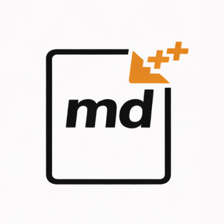

# Markdown++ Brand Assets

## Logo

The Markdown++ logo features **md** in bold black type with **++** in orange, set inside a rounded rectangle. The design communicates "Markdown, extended" at a glance.

  

## Files

### Source

| File | Usage |
|------|-------|
| `logo.png` | Primary logo (380x380, transparent background) |

### PNG Exports

All PNGs in `exports/` are downscaled from the source with transparent backgrounds.

| File | Size |
|------|------|
| `exports/logo-16.png` | 16x16 |
| `exports/logo-32.png` | 32x32 |
| `exports/logo-64.png` | 64x64 |
| `exports/logo-128.png` | 128x128 |
| `exports/logo-256.png` | 256x256 |
| `exports/favicon-16.png` | 16x16 (favicon-optimized) |
| `exports/favicon-32.png` | 32x32 (favicon-optimized) |

## Usage Guidelines

### Minimum size

The logo is legible down to 32x32 pixels. Use favicon exports for sizes 32px and below.

### Clear space

Maintain clear space around the logo equal to at least 25% of the logo's height on all sides.

### Don'ts

- Don't rotate or skew the logo
- Don't add drop shadows or gradients
- Don't change the proportions
- Don't place on busy or low-contrast backgrounds
